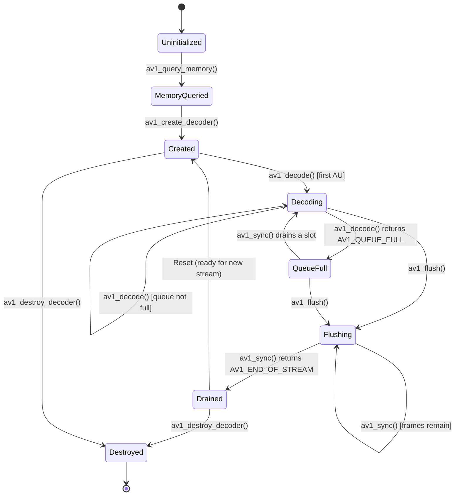
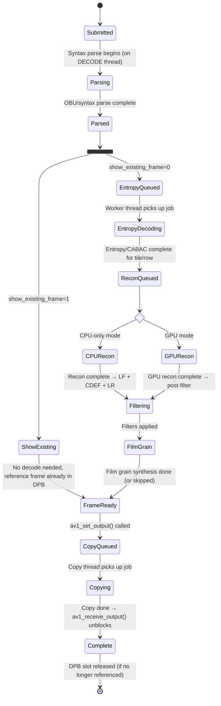
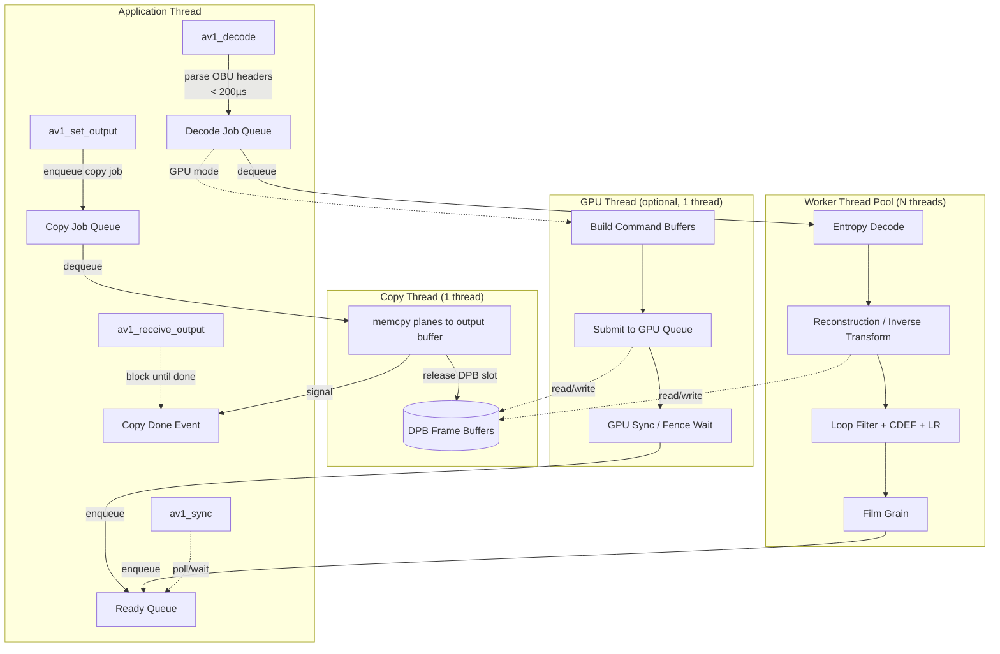
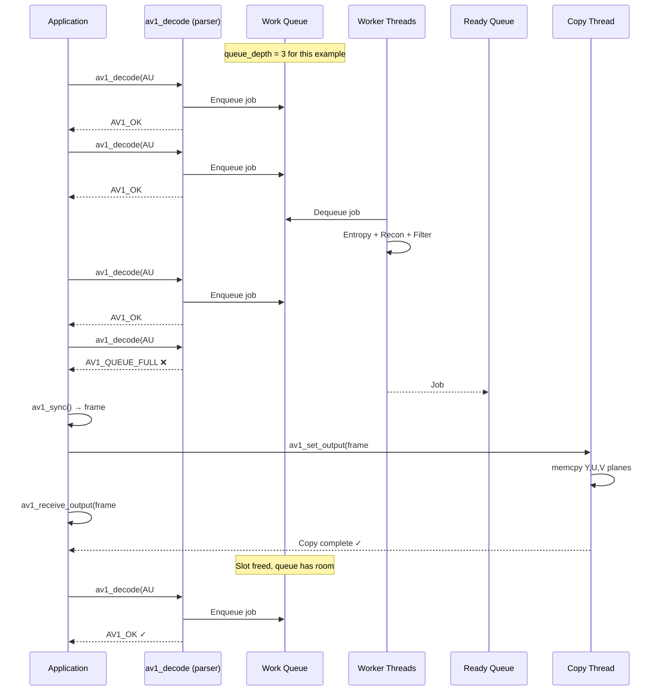
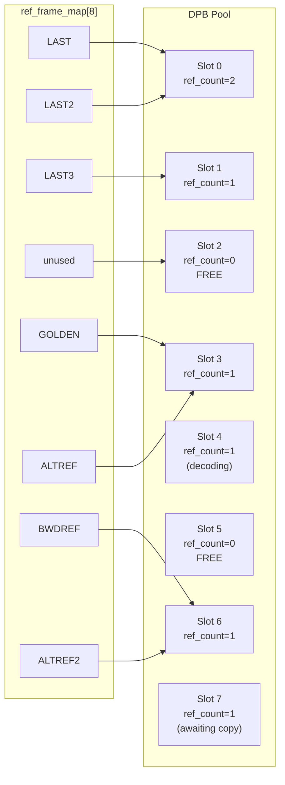
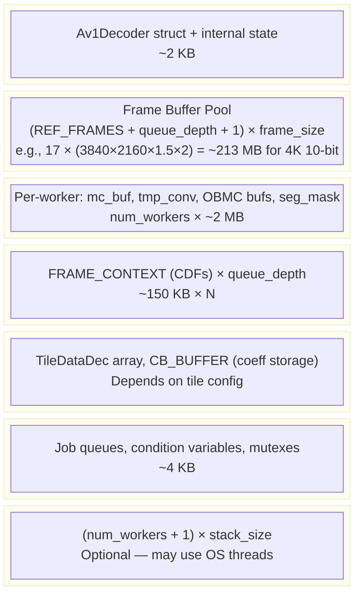

# AV1 Decoder State Machine

## Decoder Lifecycle State Machine

This is the top-level state machine for the decoder instance itself.



## Explanation

| State | Description |
|---|---|
| **Uninitialized** | No decoder exists. App calls `av1_query_memory()` to determine allocation size. |
| **MemoryQueried** | App knows how much memory to allocate. Allocates and calls `av1_create_decoder()`. |
| **Created** | Decoder is initialized. Internal allocator has carved DPB, scratch, context from the memory block. Worker threads + copy thread are created and idle. |
| **Decoding** | Actively processing AUs. `av1_decode()` accepts new AUs, workers reconstruct frames, copy thread services output requests. |
| **QueueFull** | All `queue_depth` slots are occupied. App **must** drain at least one frame via `av1_sync()` → `av1_set_output()` → `av1_receive_output()` before submitting more. |
| **Flushing** | End-of-stream signaled. No new AUs accepted. App drains remaining frames. |
| **Drained** | All frames output. Decoder can be destroyed or reset for a new sequence. |
| **Destroyed** | Threads joined, all internal state invalidated. App may free the memory block. |

---

## AU (Access Unit) Pipeline State Machine

Each AU submitted via `av1_decode()` progresses through these stages independently. Up to `queue_depth` AUs are in-flight simultaneously.



### Stage Timing Budget

| Stage | Thread | Blocking? | Target Latency |
|---|---|---|---|
| **Parsing** | Caller's thread (DECODE) | **Non-blocking** (< 200µs) | ~50–150µs for typical 4K frame |
| **Entropy** | Worker thread pool | Non-blocking (async) | ~1–5ms per tile |
| **Reconstruction** | Worker thread pool (or GPU) | Non-blocking (async) | ~2–10ms per frame |
| **Filtering** | Worker threads (row-parallel) | Non-blocking (async) | ~1–5ms per frame |
| **Copy** | Copy thread | Blocks on `av1_receive_output()` | ~0.5–2ms for 4K YUV copy |

---

## Internal Queue & Thread Interaction



### Queue Depth & Backpressure



---

## DPB (Decoded Picture Buffer) Management

AV1 uses up to **8 reference frame slots** (`REF_FRAMES = 8`). Additionally, there is always **1 frame currently being decoded**. With a queue depth of N, we need enough buffers for:

```
total_frame_buffers = REF_FRAMES + queue_depth + 1 (safety margin)
                    = 8 + N + 1
```

For `queue_depth = 8`: **17 frame buffers** in the DPB pool.



### Reference Count Rules

| Event | ref_count change |
|---|---|
| Frame assigned to `ref_frame_map` slot | +1 |
| Frame removed from `ref_frame_map` slot (replaced) | -1 |
| Frame queued for output (show_frame) | +1 |
| Frame copy completed (`av1_receive_output`) | -1 |
| ref_count reaches 0 | Slot returned to free pool |

---

## Memory Layout (from av1_query_memory / av1_create_decoder)



### Memory Calculation in av1_query_memory

```
frame_size = align64(width) × align64(height) × bytes_per_sample × planes_factor
           where planes_factor = 1.5 (4:2:0), 2.0 (4:2:2), 3.0 (4:4:4)
           and bytes_per_sample = 1 (8-bit) or 2 (10/12-bit)

dpb_count  = REF_FRAMES + queue_depth + 1

dpb_size   = dpb_count × (frame_size + mv_buffer + seg_map + grain_buffer)
scratch    = num_workers × PER_WORKER_SCRATCH
entropy    = queue_depth × sizeof(FRAME_CONTEXT)
context    = sizeof(Av1Decoder_internal) + tile_data + mode_info
queues     = queue + sync structures

total      = dpb_size + scratch + entropy + context + queues + alignment_padding
```
