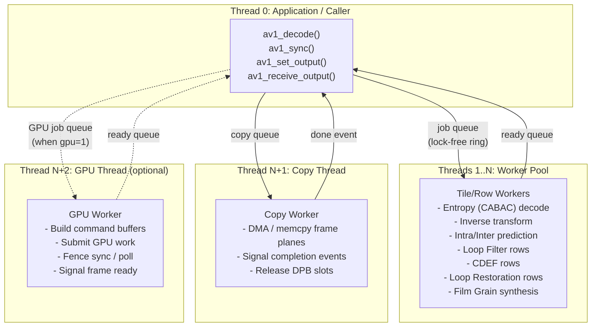
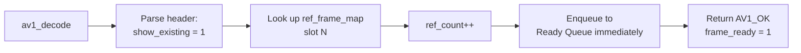
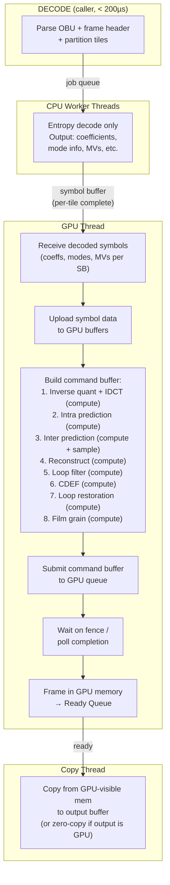
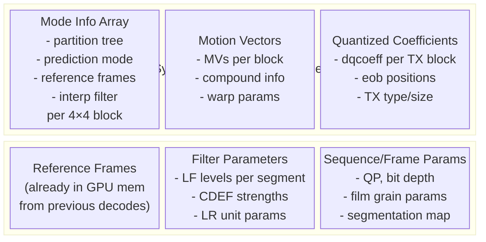
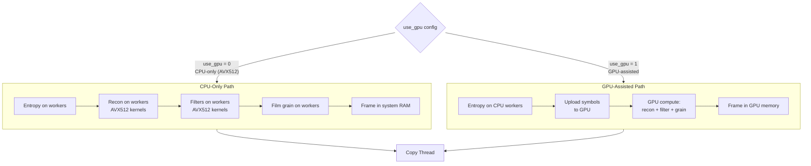
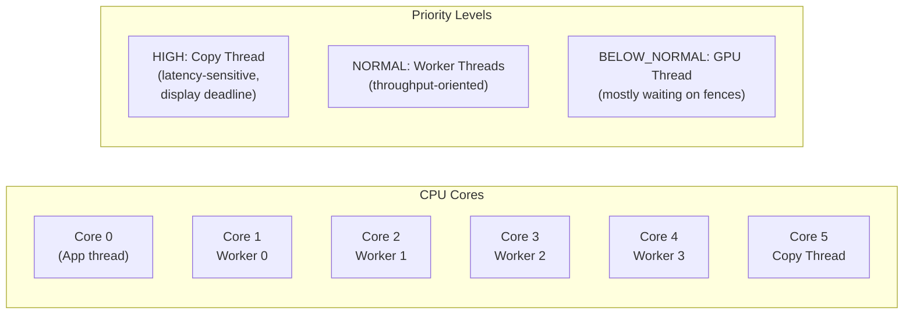

# Threading Architecture & GPU Thread Design

## Thread Model Overview



---

## CPU-Only Decode Pipeline (Detailed)

This is the current AOM model, restructured to be asynchronous.

```mermaid
flowchart LR
    subgraph "DECODE call (< 200µs)"
        P1[Parse OBU headers] --> P2[Parse frame header]
        P2 --> P3[Allocate DPB slot<br/>from pool]
        P3 --> P4[Setup tile info<br/>+ partition bitstream<br/>per tile]
        P4 --> P5[Enqueue to<br/>Work Queue]
    end

    subgraph "Worker Threads (async)"
        P5 --> E1

        subgraph "Per-Tile / Per-Row"
            E1[Entropy decode<br/>read symbols via CDF] --> R1[Inverse quantize<br/>+ inverse transform]
            R1 --> R2[Intra/Inter prediction<br/>+ reconstruction]
        end

        R2 --> LF[Loop Filter<br/>row-parallel]
        LF --> CD[CDEF<br/>row-parallel]
        CD --> LR[Loop Restoration<br/>row-parallel]
        LR --> FG[Film Grain<br/>synthesis]
        FG --> RDY[Mark frame READY<br/>→ Ready Queue]
    end

    subgraph "Copy Thread"
        RDY -.->|av1_set_output| CP[memcpy Y/U/V<br/>to output planes]
        CP --> DONE[Signal<br/>av1_receive_output]
    end
```



### What Stays on the Caller's Thread (the 200µs budget)

The critical constraint: `av1_decode()` must return in **< 200µs**. From profiling AOM, here's what fits:

| Operation | Typical Time (4K) | On caller thread? |
|---|---|---|
| OBU header parsing | ~5µs | Yes |
| Sequence header parse | ~10µs (first AU only) | Yes |
| Frame header parse | ~20–50µs | Yes |
| Tile info + bitstream partitioning | ~10–30µs | Yes |
| **Entropy decode (CABAC)** | **2–15ms** | **No — worker threads** |
| Reconstruction | 5–20ms | No — worker threads |
| Loop filter | 1–5ms | No — worker threads |
| CDEF + LR | 1–3ms | No — worker threads |
| Film grain | 0.5–2ms | No — worker threads |

The dividing line is clear: **header/syntax parsing** happens on the caller thread; everything from entropy decode onward is async.

### show_existing_frame Fast Path

When `show_existing_frame = 1`, the frame header says "output reference frame N directly." No decoding happens. This completes entirely within `av1_decode()`:



---

## GPU-Assisted Decode Pipeline

### Design Philosophy

The GPU thread replaces **reconstruction + filtering** — not entropy decoding. This is because:

1. **Entropy/CABAC is inherently serial** within a tile (symbol dependencies). It stays on CPU.
2. **Inverse transform, prediction, and filtering are massively parallel** — perfect for GPU compute shaders.
3. The GPU thread receives decoded symbols/coefficients and drives GPU execution.



### Data Flow: CPU → GPU

The CPU entropy decode produces structured data that the GPU needs. This is the **symbol buffer** — the interface between CPU workers and the GPU thread.



### GPU Memory Considerations

```
Per-frame GPU buffers:
  - Reconstructed frame:  align(W) × align(H) × bps × planes  (same as CPU)
  - Symbol buffer:        ~(W/4) × (H/4) × sizeof(ModeInfo)   (~50 MB for 4K)
  - Coefficient buffer:   ~(W/4) × (H/4) × max_coeffs         (~100 MB for 4K)
  - Reference frames:     Already in GPU memory from prior decodes

The symbol + coeff buffers are double-buffered (ping-pong) so CPU can fill
one while GPU processes the other.
```

---

## CPU-Only vs GPU Mode: Configuration



### What Changes Between Modes

| Component | CPU-Only | GPU-Assisted |
|---|---|---|
| Entropy decode | CPU worker threads | CPU worker threads (same) |
| Reconstruction | CPU workers (AVX512) | GPU compute shaders |
| Loop filter | CPU workers (row-parallel) | GPU compute |
| CDEF | CPU workers | GPU compute |
| Loop restoration | CPU workers | GPU compute |
| Film grain | CPU workers | GPU compute |
| Frame output location | System RAM (DPB pool) | GPU-visible memory |
| Copy thread source | System RAM | GPU-visible → system RAM (or direct) |
| `av1_query_memory` | Accounts for DPB in system RAM | DPB smaller (only ref frames for entropy), GPU mem separate |
| Worker thread role | Full pipeline | Entropy only |
| Additional thread | None | GPU thread (1) |

---

## Thread Affinity & Priority Mapping



The copy thread gets high priority because it's on the critical path to display — a late copy means a dropped frame. Worker threads are throughput-bound. The GPU thread mostly sleeps waiting on fences.

---

## Synchronization Primitives

| Primitive | Used For |
|---|---|
| **Lock-free ring buffer** | Decode job queue (caller → workers), ready queue (workers → caller) |
| **Condition variable** | `av1_sync()` wait, `av1_receive_output()` wait |
| **Atomic counter** | Queue depth tracking, ref_count on DPB slots |
| **Per-row mutex + condvar** | Row-MT dependencies (parse row N before decode row N-2) |
| **Fence / event** | GPU thread completion signal |
