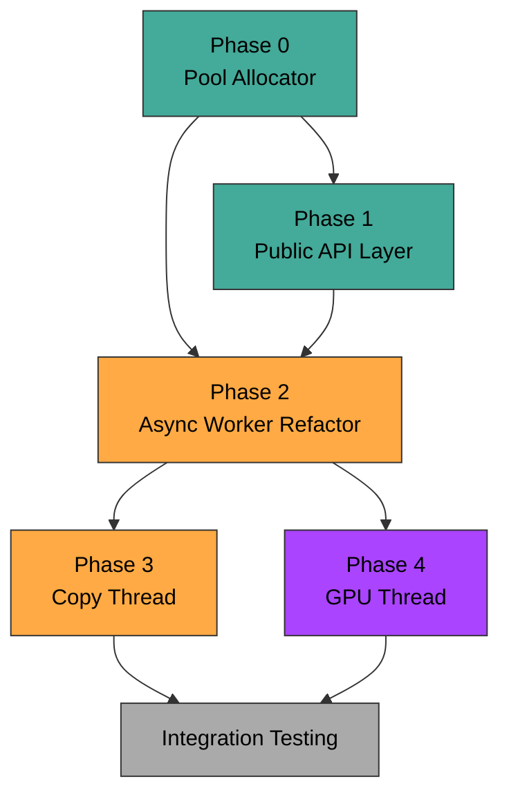

# AOM Reference Decoder Modification Plan

## Overview

This document outlines the concrete changes needed to transform the AOM reference decoder (`libaom`) into the console-style API described in `01-decoder-api-design.md`.

---

## Phase 0: Foundation — Internal Memory Allocator

**Goal**: Replace all `aom_malloc`/`aom_memalign`/`aom_free` calls within the decoder with a bump/pool allocator that operates on the caller-provided memory block.

### What to build

```c
typedef struct Av1PoolAllocator {
    uint8_t *base;          /* Start of caller memory block */
    size_t   total_size;    /* Total bytes available */
    size_t   offset;        /* Current bump pointer (for init-time allocs) */
    /* Frame buffer sub-pool (fixed-size slots returned/recycled) */
    Av1FrameSlot *frame_slots;
    int           num_frame_slots;
    uint32_t      free_mask; /* Bitmask of available slots */
} Av1PoolAllocator;
```

### Files to modify

| AOM File | Change |
|---|---|
| `aom_mem/aom_mem.c` | Add allocator-aware variants or redirect via function pointers |
| `av1/decoder/decoder.c` | Replace `aom_memalign(32, sizeof(AV1Decoder))` with pool alloc |
| `av1/common/alloccommon.c` | `av1_alloc_context_buffers()` — redirect MI, CDEF, LR allocs |
| `aom/internal/aom_codec_internal.h` | Thread allocator through codec context |
| `av1/common/av1_common_int.h` | `BufferPool` — replace `get_fb_cb`/`release_fb_cb` with pool |

### Strategy

1. **Init-time allocations** (context, tables, per-worker scratch): Use a **bump allocator**. These never free during the decoder's lifetime. Walk the offset forward, align as needed.
2. **Frame buffers** (DPB): Use a **slot allocator**. Fixed number of equal-sized slots. Acquire/release via bitmask. This replaces the `BufferPool` ref-count search.
3. **No runtime malloc**: After `av1_create_decoder()` returns, zero calls to the system allocator.

---

## Phase 1: New Public API Layer

**Goal**: Implement `av1_query_memory`, `av1_create_decoder`, `av1_decode`, `av1_sync`, `av1_set_output`, `av1_receive_output`, `av1_flush`, `av1_destroy_decoder`.

### New files to create

| File | Purpose |
|---|---|
| `av1/decoder/av1_decoder_api.h` | Public API header (from `01-decoder-api-design.md`) |
| `av1/decoder/av1_decoder_api.c` | API implementation — thin wrappers coordinating internal state |
| `av1/decoder/av1_pool_allocator.h` | Internal allocator interface |
| `av1/decoder/av1_pool_allocator.c` | Bump + slot allocator implementation |
| `av1/decoder/av1_job_queue.h` | Lock-free ring buffer for decode/ready/copy queues |
| `av1/decoder/av1_job_queue.c` | Queue implementation |
| `av1/decoder/av1_copy_thread.h` | Copy thread interface |
| `av1/decoder/av1_copy_thread.c` | Copy thread loop (wait on queue, memcpy, signal) |

### `av1_query_memory` implementation sketch

```
1. Compute frame_size from Av1StreamInfo (width × height × bps × chroma)
2. Compute dpb_count = REF_FRAMES + queue_depth + 1
3. Compute per_frame_overhead = MV buffer + seg_map + film_grain_buf
4. dpb_total = dpb_count × (frame_size + per_frame_overhead)
5. scratch = num_workers × (mc_buf×2 + tmp_conv + obmc×2 + seg_mask)
6. entropy = queue_depth × sizeof(FRAME_CONTEXT)
7. context = sizeof(Av1Decoder) + tile_data + mode_info_grid
8. queues = 3 × queue_depth × sizeof(JobEntry) + sync primitives
9. Total = sum + alignment padding (conservative: +5%)
```

### `av1_decode` implementation sketch — the 200µs path

```
1. Check queue depth → return AV1_QUEUE_FULL if at limit
2. Acquire a free DPB slot for cur_frame
3. Call existing AOM OBU parsing:
   - aom_decode_frame_from_obus() BUT only the header/setup portions
   - Specifically: read_obu_header(), read_sequence_header_obu(),
     av1_decode_frame_headers_and_setup()
4. Partition tile bitstream pointers (locate tile_group data offsets)
5. For show_existing_frame:
   - Look up reference, bump ref_count, enqueue to ready queue
   - Return immediately with frame_ready=1
6. Package job = { tile_data_ptrs, frame_context, dpb_slot, ... }
7. Enqueue job to decode work queue
8. Increment in-flight counter
9. Return AV1_OK
```

The key split point in AOM code is in `obu.c`:
- `aom_decode_frame_from_obus()` currently calls `av1_decode_frame_headers_and_setup()` (fast, keep on caller thread) then `av1_decode_tg_tiles_and_wrapup()` (slow, move to workers).

---

## Phase 2: Async Decode — Worker Thread Refactor

**Goal**: Make `av1_decode_tg_tiles_and_wrapup()` run entirely on worker threads instead of the caller's thread.

### Current AOM flow (synchronous)

```
aom_codec_decode()
  → decoder_decode() [av1_dx_iface.c]
    → aom_decode_frame_from_obus() [obu.c]
      → av1_decode_frame_headers_and_setup()   ← KEEP on caller thread
      → av1_decode_tg_tiles_and_wrapup()       ← MOVE to worker threads
        → decode_tiles() / decode_tiles_mt() / decode_tiles_row_mt()
        → av1_loop_filter_frame_mt()
        → av1_cdef_frame_mt()
        → av1_loop_restoration_filter_frame_mt()
        → av1_add_film_grain()
```

### Proposed async flow

```
av1_decode()
  → parse_obu_headers()                        [caller thread, < 200µs]
  → av1_decode_frame_headers_and_setup()        [caller thread]
  → enqueue_decode_job(tile_data, frame_ctx)    [caller thread]
  → return AV1_OK

Worker thread picks up job:
  → av1_decode_tg_tiles_and_wrapup()            [worker threads]
  → enqueue_to_ready_queue(frame_id)            [worker thread]
```

### Files to modify

| AOM File | Change |
|---|---|
| `av1/decoder/obu.c` | Split `aom_decode_frame_from_obus()` into parse + async decode |
| `av1/decoder/decodeframe.c` | Entry point for worker-driven decode; no changes to tile/row logic |
| `av1/decoder/decoder.c` | Thread pool creation moved to `av1_create_decoder`; add job dispatch |
| `av1/decoder/decoder.h` | Add job queue, ready queue, copy queue fields to `AV1Decoder` |
| `av1/common/thread_common.c` | Existing row-MT sync stays, wrap with new job lifecycle |

### Dependency: Frame-to-Frame

AV1 frames can reference other frames. A decode job for frame N must wait if its reference frames haven't finished reconstructing yet. This is handled by:

1. Each DPB slot has a `decode_complete` event/flag.
2. When a worker starts inter prediction and needs reference frame R, it checks `dpb[R].decode_complete`.
3. If not complete, the worker **waits** on that event (this is fine — workers are in a pool and other work can proceed).

This is already implicit in AOM's single-threaded model (references are always done before the next frame). In the async model we make it explicit.

---

## Phase 3: Copy Thread

**Goal**: Implement dedicated copy thread for `av1_set_output` / `av1_receive_output`.

### Copy thread loop

```c
void *copy_thread_func(void *arg) {
    Av1Decoder *dec = (Av1Decoder *)arg;
    while (!dec->copy_thread_exit) {
        CopyJob job;
        // Block until a copy job is available
        if (!dequeue_copy_job(dec, &job)) break;  // exit signal

        // Copy each plane
        RefCntBuffer *src = &dec->pool->frame_bufs[job.dpb_slot];
        YV12_BUFFER_CONFIG *fb = &src->buf;
        for (int plane = 0; plane < num_planes; plane++) {
            const uint8_t *src_row = fb->buffers[plane];
            uint8_t *dst_row = job.output.planes[plane];
            int rows = plane_height(plane, fb);
            int copy_bytes = plane_width_bytes(plane, fb);
            for (int r = 0; r < rows; r++) {
                memcpy(dst_row, src_row, copy_bytes);
                src_row += fb->strides[plane > 0];
                dst_row += job.output.strides[plane];
            }
        }

        // Signal completion
        atomic_store(&job.status, COPY_COMPLETE);
        signal_condvar(&dec->copy_done_cv);

        // Release DPB ref
        decrease_ref_count(src, dec->pool);
    }
    return NULL;
}
```

### Files to create/modify

| File | Change |
|---|---|
| `av1/decoder/av1_copy_thread.c` | New: copy thread loop |
| `av1/decoder/av1_copy_thread.h` | New: CopyJob struct, init/destroy/enqueue |
| `av1/decoder/decoder.h` | Add copy queue, copy thread handle, condvars |

---

## Phase 4: GPU Thread (Stretch)

**Goal**: Optional GPU thread that replaces CPU reconstruction + filtering.

### New files

| File | Purpose |
|---|---|
| `av1/decoder/av1_gpu_thread.h` | GPU thread interface |
| `av1/decoder/av1_gpu_thread.c` | GPU thread loop: receive symbols → build cmdbuf → submit → sync |
| `av1/decoder/av1_symbol_buffer.h` | Symbol buffer format (CPU→GPU data exchange) |

### GPU thread loop

```
while (!exit) {
    job = dequeue_gpu_job();   // blocks until CPU entropy is done for a frame

    // 1. Upload symbol data (coefficients, modes, MVs) to GPU
    upload_symbol_buffer(job.symbol_buf, gpu_staging_buffer);

    // 2. Build command buffer
    cmdbuf = begin_command_buffer();
    // For each superblock row:
    //   dispatch_compute(inverse_quant_idct_shader, ...);
    //   dispatch_compute(intra_pred_shader, ...);
    //   dispatch_compute(inter_pred_shader, ...);  // reads ref frames in GPU mem
    //   dispatch_compute(loop_filter_shader, ...);
    //   dispatch_compute(cdef_shader, ...);
    //   dispatch_compute(loop_restoration_shader, ...);
    //   dispatch_compute(film_grain_shader, ...);
    end_command_buffer(cmdbuf);

    // 3. Submit
    submit(gpu_queue, cmdbuf, &fence);

    // 4. Wait for completion
    wait_fence(fence);

    // 5. Frame is now in GPU memory → enqueue to ready queue
    enqueue_ready(job.frame_id);
}
```

### Symbol Buffer Layout (what the GPU needs from CPU entropy decode)

```c
typedef struct Av1SymbolBuffer {
    /* Per 4×4 block mode info */
    struct {
        uint8_t  partition_type;
        uint8_t  prediction_mode;
        uint8_t  ref_frames[2];       /* reference indices */
        int16_t  mv[2][2];            /* motion vectors (row, col) × 2 refs */
        uint8_t  interp_filter[2];
        uint8_t  tx_size;
        uint8_t  tx_type;
        uint8_t  segment_id;
        uint8_t  skip;
        uint8_t  is_inter;
        uint8_t  compound_type;
        /* ... warp, palette, etc. as needed */
    } *mode_info;                      /* [mi_rows × mi_cols] */
    int mi_rows;
    int mi_cols;

    /* Dequantized coefficients per transform block */
    struct {
        int16_t *dqcoeff;              /* coefficient data */
        uint16_t eob;                  /* end of block */
        uint8_t  tx_size;
        uint8_t  tx_type;
    } *tx_blocks;                      /* [num_tx_blocks] */
    int num_tx_blocks;

    /* Frame-level parameters for GPU shaders */
    int  base_qindex;
    int  y_dc_delta_q, u_dc_delta_q, v_dc_delta_q;
    int  u_ac_delta_q, v_ac_delta_q;
    int  bit_depth;
    int  lf_level[4];                  /* loop filter levels */
    int  cdef_damping;
    int  cdef_strengths[8];            /* CDEF Y+UV strengths per block */
    /* Loop restoration unit params, film grain params, etc. */
} Av1SymbolBuffer;
```

---

## Phase Dependency Graph



**Legend**: Green = foundational, Orange = core pipeline, Purple = stretch/GPU

---

## Key AOM Split Points (Where to Cut)

The most important surgical point in AOM is in `av1/decoder/obu.c`, function `aom_decode_frame_from_obus()`:

```
Line ~600:  av1_decode_frame_headers_and_setup()    ← STAYS on caller thread
Line ~620:  av1_decode_tg_tiles_and_wrapup()        ← MOVES to async workers
```

Inside `av1_decode_tg_tiles_and_wrapup()` (decodeframe.c ~line 5359):
- Tile decode dispatch is already worker-aware (row_mt / tile_mt paths exist)
- Post-decode filters already have `_mt` variants
- The wrapup (ref frame update, output queue) happens after all tiles are done

The refactor is: **don't call `av1_decode_tg_tiles_and_wrapup()` from the caller thread — package it as a job and return immediately.**
